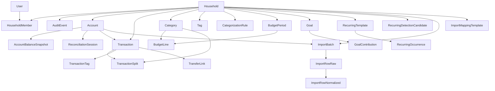
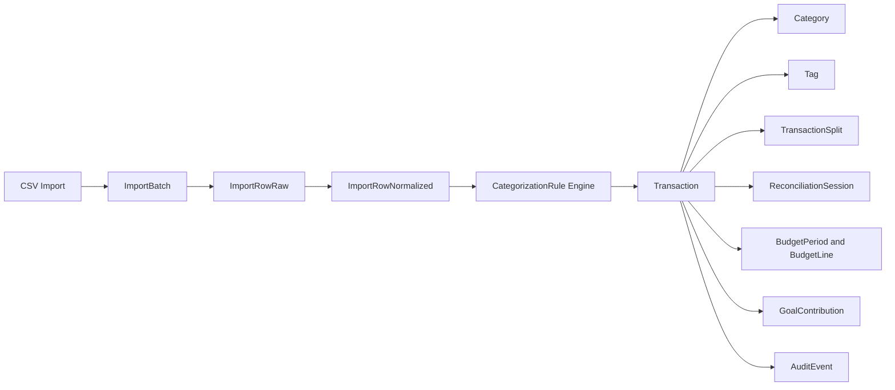

# Domain model

```yaml
version: 1.0.0
last_updated: 2026-04-04
breaking: "no"
```

## Entity glossary

| Entity | One-line definition |
|--------|---------------------|
| `Household` | Tenant root; owns currency and timezone. |
| `User` | Login identity; can belong to many households via membership. |
| `HouseholdMember` | Join of user to household with role. |
| `AuditEvent` | Lightweight append-only activity log for accountability. |
| `Account` | Financial container (checking, credit, etc.) with balances. |
| `AccountBalanceSnapshot` | Point-in-time balance for history and reconciliation context. |
| `ReconciliationSession` | One reconciliation attempt for an account over a statement period. |
| `Transaction` | Single posting: income, expense, or one leg of a transfer. |
| `TransferLink` | Pairs two transactions as one logical transfer. |
| `TransactionSplit` | Allocates part of one transaction to a category. |
| `TransactionTag` | Many-to-many link transaction ↔ tag. |
| `Category` | Hierarchical classification; budget lines attach here. |
| `Tag` | Cross-cutting label. |
| `CategorizationRule` | Condition/action JSON for auto-categorization. |
| `BudgetPeriod` | Time bucket (e.g. month) for planning. |
| `BudgetLine` | Planned amount per category within a period. |
| `Goal` | Savings or paydown target. |
| `GoalContribution` | Movement toward a goal (manual or linked to transaction). |
| `RecurringTemplate` | Definition of expected recurring cashflow. |
| `RecurringOccurrence` | One expected instance (due date, match state). |
| `RecurringDetectionCandidate` | Suggested template from pattern mining. |
| `ImportBatch` | One upload/import run for an account. |
| `ImportRowRaw` | Unparsed CSV row payload. |
| `ImportRowNormalized` | Parsed row ready for dedupe and promotion. |
| `ImportMappingTemplate` | Saved column mapping for repeat imports. |

## Relationship diagram (ERD)

High-level ownership and foreign keys. Implementation may add indexes and soft-delete columns per [03-entities-fields.md](03-entities-fields.md).



## Transaction-centric data flow



## References

- Field-level spec: [03-entities-fields.md](03-entities-fields.md)
- Enums: [05-enums-and-statuses.md](05-enums-and-statuses.md)
