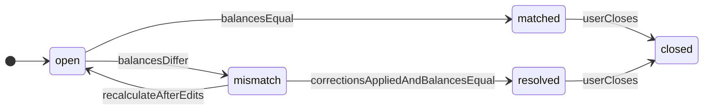

# Enums and statuses

```yaml
version: 1.0.0
last_updated: 2026-04-04
breaking: "no"
```

Single source of truth for string enums stored in the database or API. Use **lowercase snake_case** values unless an external integration requires otherwise.

## Household

| Enum | Values |
|------|--------|
| `Household.status` (optional) | `active`, `archived` |

## HouseholdMember

| Enum | Values |
|------|--------|
| `HouseholdMember.role` | `owner`, `admin`, `member`, `viewer` |
| `HouseholdMember.status` | `active`, `invited`, `removed` |

## Account

| Enum | Values |
|------|--------|
| `Account.type` | `checking`, `savings`, `cash`, `credit`, `other` |

## AccountBalanceSnapshot

| Enum | Values |
|------|--------|
| `AccountBalanceSnapshot.source` | `manual`, `imported`, `system` |

## Transaction

| Enum | Values |
|------|--------|
| `Transaction.type` | `income`, `expense`, `transfer` |
| `Transaction.status` | `cleared`, `pending` |

**Reconciliation rule:** `calculated_ending_balance` for a session includes only transactions with `status = cleared` and `transaction_date` (or `posted_date`—pick one convention and use consistently) within `[period_start, period_end]`. Document the chosen date field in API docs.

## Category

| Enum | Values |
|------|--------|
| `Category.kind` | `income`, `expense`, `transfer_neutral` |

## Budget

| Enum | Values |
|------|--------|
| `BudgetPeriod.status` | `draft`, `active`, `closed` |

## Goal

| Enum | Values |
|------|--------|
| `Goal.goal_type` | `savings`, `paydown` |
| `Goal.status` | `active`, `completed`, `cancelled` |

## GoalContribution

| Enum | Values |
|------|--------|
| `GoalContribution.source_type` | `manual`, `transaction_link`, `allocation` |

## Recurring

| Enum | Values |
|------|--------|
| `RecurringTemplate.flow_type` | `expense`, `income` |
| `RecurringTemplate.frequency` | `weekly`, `monthly`, `yearly`, `custom` |
| `RecurringOccurrence.status` | `upcoming`, `paid`, `missed`, `skipped` |
| `RecurringDetectionCandidate.status` | `suggested`, `accepted`, `rejected` |

## Import

| Enum | Values |
|------|--------|
| `ImportBatch.source_type` | `csv`, `manual` |
| `ImportBatch.status` | `pending`, `processing`, `completed`, `failed`, `partially_applied` |

---

## ReconciliationSession.status — state machine

Allowed states:

| State | Meaning |
|-------|---------|
| `open` | Session created; calculation may be in progress or not yet finalized. |
| `matched` | Statement balance equals calculated balance for the period. |
| `mismatch` | Balances differ; user or system must investigate. |
| `resolved` | Mismatch addressed (transactions corrected); balances now align. |
| `closed` | Session finalized; no further edits expected (policy may allow reopen → new session). |

### Transitions



**Rules:**

1. On create, set `status = open`; compute `calculated_ending_balance` and compare to `statement_ending_balance`.
2. If equal (within **zero tolerance** for v1—no penny fudge unless later added), may transition `open → matched` in one step.
3. If not equal: `open → mismatch`.
4. After ledger fixes: recompute; if equal → `resolved`; optionally auto-`closed` if product policy says so.
5. `matched` may go to `closed` without passing through `mismatch`.
6. Reopening a closed session is **out of scope** for v1; create a **new** `ReconciliationSession` if needed.

---

## CategorizationRule priority

Pick one global convention and stick to it in code:

- **Option A:** Lower `priority` number runs first.
- **Option B:** Higher `priority` number runs first.

State the choice in the API/implementer README when building the app.

## References

- Workflows: [04-workflows.md](04-workflows.md)
- Fields: [03-entities-fields.md](03-entities-fields.md)
